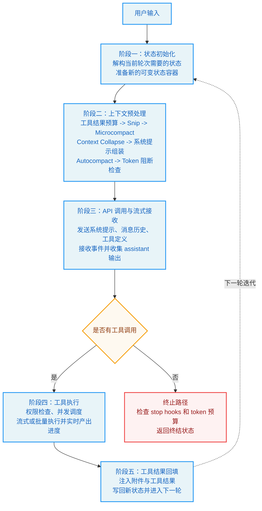

#  Agent 主循环

做 Agent 时，真正决定系统体验的，往往不是某一次模型调用，而是外围那层“对话循环”怎么组织。它要负责接住用户输入，组装上下文，发起模型请求，处理流式输出，调度工具执行，再把结果回填给模型进入下一轮。

Claude Code 的主循环选择了 `async function*` 作为入口，这个设计非常关键。异步生成器既能逐步向外产出事件，又能在工具执行、流式响应和多轮对话之间自然地暂停与恢复，因此非常适合作为 Agent Runtime 的骨架。

这篇文章想回答三个问题：

1. 为什么主循环适合用异步生成器来承载。
2. 一次完整的对话迭代到底会经过哪些阶段。
3. 事件流、消息模型和工具执行是如何在同一个循环里闭环的。

## 为什么主循环用 `async function*`

如果把 Claude Code 的运行过程看成一个普通函数调用，它其实并不成立。因为一次对话不是“输入一次，输出一次”这么简单，中间还会穿插很多需要持续对外暴露的过程状态：

- 模型请求是否已经开始。
- 文本是否正在流式返回。
- 是否检测到了工具调用。
- 工具执行是否仍在进行。
- 当前轮次是否结束，是否要继续进入下一轮。

  `async function*` 的价值就在这里。它既保留了异步流程的表达能力，又允许系统像事件流一样不断 `yield` 中间结果。对 UI 来说，这意味着界面不需要等到整个流程结束才更新；对 Runtime 来说，这意味着主循环可以在“模型输出”和“工具执行”之间自然切换，而不是把所有状态硬塞进回调或者事件总线里。

  简单说，异步生成器让 Claude Code 的主循环同时具备了三种能力：

  1. 能流式向外暴露过程信号。
  2. 能在任意阶段暂停和恢复。
  3. 能把多轮模型调用与工具调用收敛到同一套控制流里。

## 整体流程

在细看事件类型和状态结构之前，先看一遍主循环的整体形态。下面这张图基本概括了 Claude Code 一次对话迭代的完整路径。



这张图里最重要的不是“五个阶段”本身，而是它体现出一个典型的 Agent 闭环：

1. 先基于历史状态准备好本轮上下文。
2. 让模型决定是直接回答，还是先调用工具。
3. 如果有工具调用，就执行工具并把结果重新送回模型。
4. 重复这个过程，直到模型不再请求工具，进入终止路径。

也就是说，Claude Code 的主循环并不是简单地“请求模型一次”，而是在不断推进一台带状态的对话状态机。

## 事件流：UI 如何感知对话正在发生什么

异步生成器之所以成立，是因为主循环会不断向外产出事件。对 UI 来说，这些事件就是整个会话的“心跳信号”。

### 1. `stream_request_start`

每次 API 请求真正发出前，循环都会先产出一个 `stream_request_start` 事件。它的作用很直接：告诉界面“新一轮思考开始了”。

这个事件本身不携带复杂业务信息，但很重要，因为 UI 可以据此切换到“正在思考”或“正在请求模型”的状态，而不必等到第一段文本流回来才更新界面。

### 2. `StreamEvent`

`StreamEvent` 是来自模型 API 的原始流式事件，例如文本增量、thinking 块、`tool_use` 块等。它基本属于“底层透传”，价值在于保留最原始的流式语义，让上层可以精细控制展示方式。

如果只保留最终拼装后的消息对象，很多中间态都会丢失，比如逐字输出、工具调用开始的时机、thinking block 的出现顺序。保留 `StreamEvent`，可以让 Runtime 和 UI 在“原始流”这个层面保持同步。

### 3. `Message`

`Message` 是比 `StreamEvent` 更高一层的结构化结果，包含 `AssistantMessage`、`UserMessage`、`SystemMessage` 等。它的核心作用是把原始流式事件整理成“对话历史可以真正消费的数据结构”。

换句话说，`StreamEvent` 更像传输层信号，`Message` 更像对话层状态。

### 4. `TombstoneMessage`

当流式回退发生时，前面已经展示出去的部分消息可能需要被废弃。这时候就会用到 `TombstoneMessage`。

你可以把它理解成一种“撤回通知”：告诉 UI 某条先前展示的消息已经失效，需要从历史记录里移除。没有这种机制，界面就很容易出现重复消息、过期消息或错序内容。

### 5. `ToolUseSummaryMessage`

当一批工具调用执行完成后，系统还会额外生成 `ToolUseSummaryMessage`，用来把冗长的工具输出折叠成较短摘要。

这个设计非常实用。因为真实 Agent 会话里，工具输出往往比最终回答长得多，如果把每次命令输出、文件读取和中间结果都完整平铺在 UI 中，用户很快就会被工具日志淹没。摘要消息的意义，就是在保留可追溯性的同时，控制信息密度。

## 消息模型

从代码实现上看，Claude Code 的消息对象并不复杂，但它们背后的协议约束很值得注意。

### `UserMessage`

`UserMessage` 不只承载用户输入，也承载工具执行结果，也就是 `tool_result`。这听起来有点反直觉，但背后是协议层面的限制：在模型 API 视角里，常见角色通常只有 `system`、`user`、`assistant` 三类。

工具结果如果想被模型“看到”，就必须以它能够理解的角色继续进入对话上下文。于是，工具执行结果被包装为 `user` 侧消息，本质上是一种工程约束驱动下的设计选择。

### `AssistantMessage`

`AssistantMessage` 表示模型当前轮次产出的内容。它既可能只有文本，也可能在文本之后追加 `tool_use` 块。

这也是 Agent 交互里一个很重要的体验特征：模型可以一边解释自己准备做什么，一边发起工具调用。用户看到的不再是黑盒式执行，而是一种“边说边做”的过程。

### `SystemMessage`

`SystemMessage` 主要用于 UI 层面的系统通知，例如模型回退、权限变化等。它通常不直接参与模型 API 的对话历史，但对用户理解当前系统状态很有帮助。

### `AttachmentMessage` 与 `ProgressMessage`

除了标准对话消息，Claude Code 还需要处理附件和进度信息。

- `AttachmentMessage` 用来承载文件变更通知、内存文件内容或任务级附加信息。
- `ProgressMessage` 用来流式反馈工具执行状态，例如 Bash 输出、读取文件进度等。

这两类消息的存在说明了一点：Agent 的“消息”不只是自然语言，还包括运行时状态本身。

## 迭代过程

把事件和消息放到主循环里看，一次完整迭代可以拆成五个阶段。

### 阶段一：状态初始化

`queryLoop` 本质上是一个 `while (true)` 循环。每次回到循环顶部，都会从状态对象中解构出本轮需要的数据，例如消息列表、工具上下文、自动压缩状态、重试计数器和 turn 计数。

这一步的重点不是“读取变量”，而是准备好一个新的状态快照。因为 Agent 不是纯函数，它必须跨轮次保留历史，而新的轮次又会在旧状态基础上继续生长。

### 阶段二：上下文预处理

在真正调用模型之前，Claude Code 会先做一轮上下文整理，目的是在有限 token 窗口里保留最有价值的信息。现有流程可以概括成七步：

1. 工具结果预算：限制过大的工具输出，必要时只保留摘要或引用。
2. Snip 压缩：对过长历史做直接裁剪。
3. Microcompact：在自动压缩前做轻量级、缓存友好的压缩。
4. Context Collapse：把连续消息折叠为更紧凑的上下文视图。
5. 系统提示组装：拼接基础系统提示和动态上下文。
6. Autocompact：在超过阈值时自动摘要历史消息。
7. Token 阻断检查：超出硬限制就直接中止，不再发起请求。

这一步非常像一个“上下文编排层”。它的目标不是单纯压缩文本，而是在准确性、缓存命中率和 token 成本之间寻找平衡。

### 阶段三：API 调用与流式接收

预处理完成后，主循环会把系统提示、消息历史和工具定义一起发给模型 API，并开始流式接收返回结果。

这一阶段通常会并行完成三件事：

- 把原始流式事件实时 `yield` 给上层。
- 把 assistant 文本逐步拼装成结构化消息。
- 收集可能出现的 `tool_use` 块，判断是否需要进入工具执行阶段。

如果启用了流式工具执行，那么工具甚至可以在响应尚未完全结束前就开始调度。这会进一步降低整体等待时间。

### 阶段四：工具执行

当流式响应结束后，循环会检查本轮是否有待执行工具。

如果没有工具调用，那么当前对话就可以直接走向终止路径，检查 stop hooks、token 预算等退出条件，然后返回终结状态。

如果有工具调用，系统就会进入工具执行阶段。这里的关键点有三个：

1. 先做权限校验，避免工具越权执行。
2. 根据策略决定串行、并发或分区调度。
3. 工具执行过程本身也以事件流形式持续向外反馈。

因此，工具执行并不是“阻塞式黑盒”，而是主循环内部的另一条可观察子流程。

### 阶段五：工具结果回填与下一轮

工具执行结束后，系统会把工具结果、附件消息以及本轮 assistant 输出一起写回新的状态对象，然后通过 `continue` 返回到 `while (true)` 顶部。

这一步决定了 Agent 为什么可以多轮闭环。因为模型在下一轮看到的，不只是自己的上一条回答，还包括刚刚产生的工具结果。只有这样，它才能基于真实执行结果继续推理，决定是再次调用工具，还是给出最终答案。

## 状态对象为什么是整个循环的核心

如果说异步生成器负责控制流，那么状态对象负责保存上下文。它是跨轮次传递信息的核心载体。

下面这个简化后的结构，基本可以概括 `queryLoop` 需要维护的关键信息：

```ts
interface QueryLoopState {
  messages: Message[]

  toolContext: {
    tools: Tool[]
    toolResults: ToolResult[]
    pendingToolUses: ToolUse[]
  }

  compactionState: {
    hasBeenCompacted: boolean
    compactionCount: number
    lastCompactionTokenCount: number
  }

  retryState: {
    retryCount: number
    maxRetries: number
    lastError: Error | null
  }

  turnCount: number

  tokenBudget: {
    inputTokensUsed: number
    outputTokensUsed: number
    budgetLimit: number | null
    isExceeded: boolean
  }
}
```

这个状态结构至少承担了四类职责：

- 保存完整消息历史，保证模型下一轮能看到足够上下文。
- 保存工具执行上下文，管理待执行和已完成的工具调用。
- 保存压缩与重试信息，支撑异常恢复和上下文治理。
- 保存 token 预算与轮次信息，控制循环何时继续、何时终止。

也正因为状态集中在这里，Claude Code 才能把“模型调用”“工具执行”“异常恢复”“上下文压缩”几件本来分散的事情，放进同一套循环里统一管理。

## 这种设计解决了什么问题

把整条链路串起来看，Claude Code 的主循环并不只是工程实现细节，它实际上解决了 Agent Runtime 里几个非常核心的问题。

### 1. 对话过程可观察

无论是 `stream_request_start`、原始 `StreamEvent`，还是工具进度与摘要消息，这些设计都在服务同一件事：让用户看到系统正在做什么，而不是只看到一个最终结果。

### 2. 工具调用成为对话的一部分

很多系统把工具执行做成模型调用外部的一条旁路，但 Claude Code 把它纳入主循环本身。这样一来，工具结果天然可以进入下一轮上下文，模型与工具之间形成闭环。

### 3. 上下文控制有明确落点

随着对话变长，真正的瓶颈往往不是推理能力，而是上下文窗口和 token 成本。通过预算控制、压缩管线和自动折叠，Claude Code 把“上下文治理”前置成了主循环里的正式阶段。

### 4. 暂停、恢复和回退成为自然能力

当控制流建立在异步生成器和状态对象之上时，暂停、恢复、流式回退和错误重试都不再是临时补丁，而是这个运行时天然支持的能力。

## 总结

从表面上看，Claude Code 的主循环只是一个 `async function*`。但往里拆就会发现，它实际上把事件流、消息模型、上下文治理、工具调度和多轮状态推进统一到了同一套运行时结构里。

这也是为什么 Agent 系统的难点从来不只是“调一次模型 API”。真正复杂的地方在于，你要如何把模型输出、工具执行和用户界面连接成一条可观察、可恢复、可持续迭代的闭环。Claude Code 这套主循环的设计，正是对这个问题的一种很典型的工程回答。
